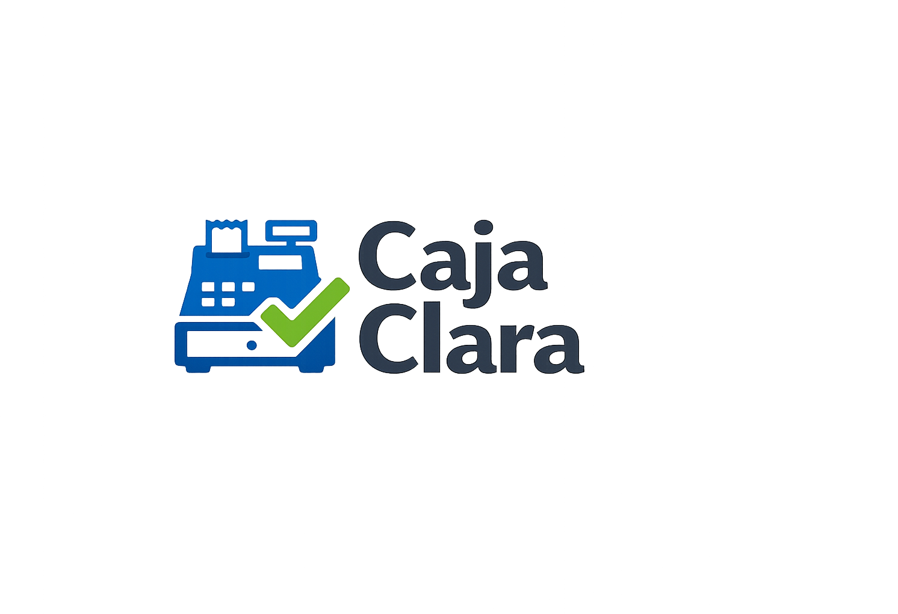

# Caja Clara



Caja Clara es una app Flutter para comercios chicos que necesitan vender, manejar caja, controlar productos y trabajar con barcode desde una base local y simple.

La version principal es Windows desktop. La version web en GitHub Pages queda como demo, landing o adicional comercial, no como reemplazo de la app local.

## Producto principal: Windows

La experiencia de Windows esta pensada para uso diario en PC:

- venta, gasto, caja y resumen en una sola app local
- catalogo con stock, costo, precio y barcode
- scanner por camara donde existe soporte y, en Windows, flujo comodo para scanner tipo teclado
- lookup local-first por codigo de barras y alta asistida cuando no hay match
- exportacion Excel y backup JSON
- prueba de 30 dias con activacion manual posterior
- modo solo lectura al vencer: los datos siguen visibles y exportables, pero se bloquean acciones operativas hasta activar

## Web / GitHub Pages como extra

La web sirve para:

- demo comercial
- landing o vidriera
- presencia online simple

No esta planteada como producto principal. La operacion real y la propuesta mas fuerte quedan en Windows.

## Flujos principales

- apertura y cierre de caja
- venta de catalogo y venta libre
- gastos
- alta y edicion de productos
- scanner / barcode con fallback manual
- resumen operativo del dia
- exportacion y backup

## Scanner y barcode

Caja Clara no promete magia falsa:

- primero busca el barcode en el catalogo local
- si no existe, puede consultar un catalogo externo configurable
- si encuentra datos confiables, autocompleta nombre y categoria sugerida
- si no encuentra datos, deja el codigo cargado para alta manual asistida
- nunca inventa nombre o categoria

En Windows, el flujo esta optimizado para lectores USB o Bluetooth que funcionan como teclado: escanear y Enter suele ser suficiente.

## Trial y activacion

La version Windows incluye:

- prueba gratuita de 30 dias
- activacion manual por codigo
- estado visible de prueba / activa / solo lectura

Cuando vence la prueba:

- puedes seguir abriendo la app
- puedes seguir viendo datos, exportando Excel y haciendo backup
- no puedes registrar ventas, gastos, cambios de catalogo, stock o caja hasta activar

La activacion se hace desde la propia app usando el ID de instalacion que muestra Caja Clara.

## Desarrollo local

Desde la raiz del repo:

```powershell
flutter pub get
flutter run -d windows
```

## Validacion de release

```powershell
flutter analyze --no-pub
flutter test --no-pub
flutter build web --no-pub
flutter build windows --no-pub
```

## Build Windows

Comando directo:

```powershell
flutter build windows --release
```

Script recomendado:

```powershell
.\scripts\build_windows.ps1
```

Salida principal:

```text
build/windows/x64/runner/Release/CajaClara.exe
```

## Abrir rapido en Windows

Launcher local:

- [`Caja Clara Launcher.ps1`](./Caja%20Clara%20Launcher.ps1)
- [`Caja Clara Launcher.bat`](./Caja%20Clara%20Launcher.bat)

El launcher:

- abre `CajaClara.exe` si ya existe el release
- si no existe, ejecuta el build release
- luego abre la app

## Paquete portable

Script:

```powershell
.\scripts\package_windows_release.ps1
```

Salida:

```text
dist/windows-portable/CajaClara/
dist/windows-portable/CajaClara-win64.zip
```

Ese paquete sirve para entregar una version portable lista para copiar y usar.

## MSIX / instalable

Script:

```powershell
.\scripts\package_msix.ps1
```

Opcionalmente, para crear e instalar en la misma maquina:

```powershell
.\scripts\package_msix.ps1 -InstallAfterCreate
```

Salida:

```text
dist/msix/CajaClara.msix
certs/caja-clara-dev.cer
certs/caja-clara-dev.pfx
```

Notas reales:

- el script genera un certificado local de desarrollo si hace falta
- el MSIX queda firmado para pruebas razonables
- la instalacion puede requerir confiar el certificado segun la politica del equipo

## CI

Workflows incluidos:

- [`pages.yml`](./.github/workflows/pages.yml): build y deploy de GitHub Pages
- [`windows-release.yml`](./.github/workflows/windows-release.yml): analyze, test, build Windows y artefactos de release

## Estructura

```text
caja-clara/
|- .github/
|- assets/
|- docs/
|- lib/
|- scripts/
|- test/
|- web/
`- windows/
```

## Mini manual

- [`mini_manual_caja_clara.md`](./docs/mini_manual_caja_clara.md)
